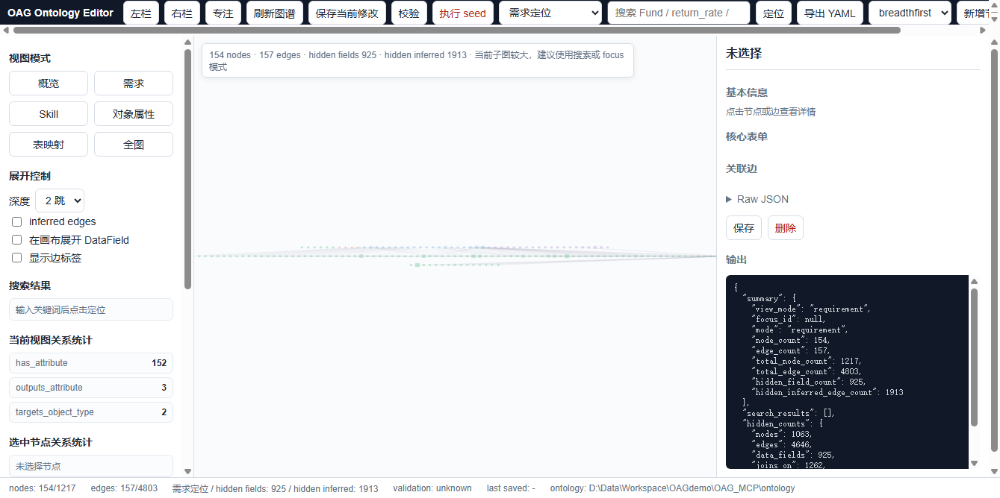
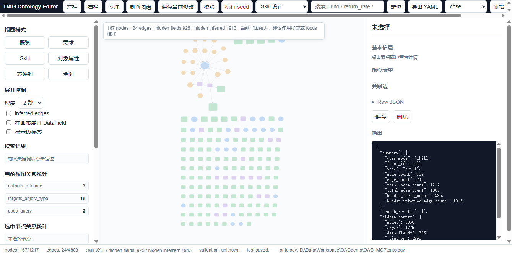
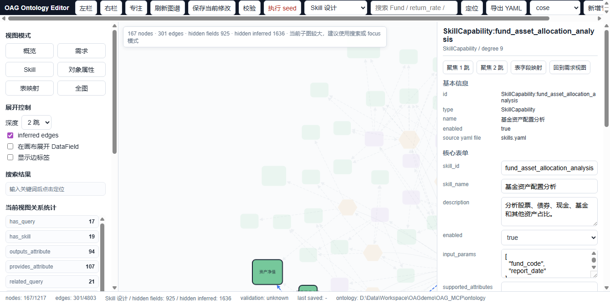
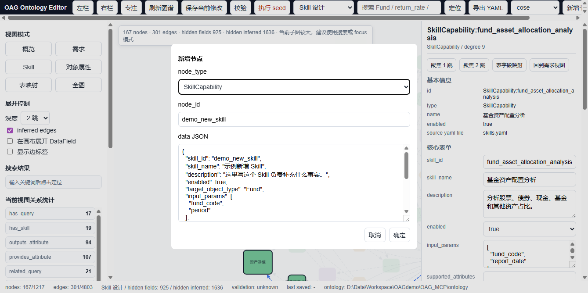
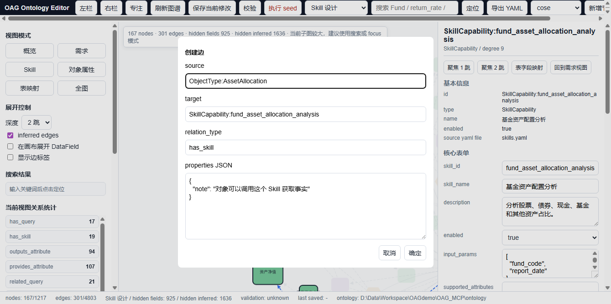
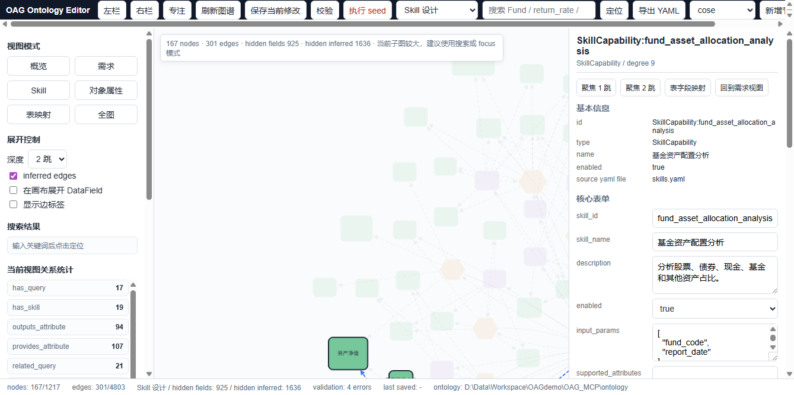

# OAG Ontology Editor 使用说明书

> 本说明以 `http://127.0.0.1:8011` 的 Editor 服务为准。截图来自当前工作区的 8011 服务页面。

## 1. 这个 Editor 是做什么的

OAG Ontology Editor 是一个本体配置编辑器。简单说，它不是用来查真实基金数据的，也不是用来跑真实业务 SQL 的，而是用来维护 `ontology/*.yaml` 这些配置文件的。

你平时会用它做这些事：

- 看当前本体里有哪些对象，比如基金、基金经理、基金公司、收益指标、风险指标。
- 看对象下面有哪些属性，比如收益率、最大回撤、基金代码、基金名称。
- 看对象、属性、查询能力、Skill、Intent、数据表之间是怎么连起来的。
- 新增或修改节点，比如新增一个 Skill、新增一个对象、新增一个关系类型。
- 新增显式边，比如把某个对象和某个 Skill 连起来。
- 保存 YAML、校验 YAML、必要时执行 seed 写入数据库。

当前 Editor 只会读写白名单内的 YAML 文件。每次保存前会自动备份原文件到 `ontology/.backups/`。

## 2. 如何启动项目

启动前先确认你在项目根目录，也就是包含 `ontology_editor/`、`ontology/`、`scripts/` 的这个目录：

```powershell
cd D:\Data\Workspace\OAGdemo\OAG_MCP
```

如果本地已经有 `.venv`，优先用项目自带虚拟环境启动。推荐启动 `8011` 端口：

```powershell
.\.venv\Scripts\python.exe -m uvicorn ontology_editor.app:app --host 127.0.0.1 --port 8011 --reload
```

看到类似下面的信息，就说明服务已经起来了：

```text
Uvicorn running on http://127.0.0.1:8011
```

然后浏览器打开：

```text
http://127.0.0.1:8011
```

如果你没有 `.venv`，先安装依赖：

```powershell
python -m pip install fastapi uvicorn PyYAML pydantic
```

再启动：

```powershell
python -m uvicorn ontology_editor.app:app --host 127.0.0.1 --port 8011 --reload
```

也可以用下面这个脚本入口启动：

```powershell
.\.venv\Scripts\python.exe ontology_editor\app.py
```

但要注意：这个脚本入口在当前代码里默认监听 `8010`。如果你要使用最新约定的 `8011` 服务，优先用上面的 `uvicorn ... --port 8011` 命令。

启动后可以用 PowerShell 快速确认页面是否正常返回：

```powershell
Invoke-WebRequest -UseBasicParsing http://127.0.0.1:8011/ -TimeoutSec 5
```

也可以确认图谱接口是否正常：

```powershell
Invoke-WebRequest -UseBasicParsing http://127.0.0.1:8011/api/graph -TimeoutSec 10
```

常见启动问题：

- 提示端口被占用：把 `--port 8011` 换成其他空闲端口，或者先停止占用 8011 的旧进程。
- 页面能打开但图谱为空：先访问 `/api/graph`，看接口返回里有没有 YAML 解析错误。
- 提示找不到 `uvicorn`：说明当前 Python 环境没装依赖，先执行 `python -m pip install fastapi uvicorn PyYAML pydantic`。
- 只想启动 MCP Server：那是另一个服务，命令是 `python -m oag_mcp.server`，它读取已经 seed 到 MySQL 的元数据，不负责打开 Editor 页面。
- 启动 Editor 不会自动 seed，保存 YAML 也不会自动 seed。只有点击页面里的 `执行 seed` 才会尝试写数据库。

## 3. 打开页面

浏览器访问：

```text
http://127.0.0.1:8011
```

打开后大概会看到这样的页面：



这个页面可以按三块来理解：

- 左侧是导航区：视图模式、展开控制、搜索结果、当前视图关系统计、YAML 文件列表。
- 中间是图谱画布：节点和边都画在这里，可以拖动、缩放、点击。
- 右侧是 Inspector：点中某个节点或边后，在这里看详情、改字段、保存或删除。

顶部工具栏是最常用的地方：

- `刷新图谱`：重新从 YAML 读取图谱。
- `保存当前修改`：保存右侧 Inspector 当前选中的节点或边。
- `校验`：检查 YAML 引用有没有错误。
- `执行 seed`：确认后执行 `scripts/seed_ontology.py` 写入数据库。
- `搜索框 + 定位`：按关键词定位节点。
- `导出 YAML`：下载当前 ontology YAML zip。
- `新增节点`：新增 ObjectType、Attribute、RelationType、SkillCapability 等节点。
- `创建边`：在两个已有节点之间新增显式边。

## 4. 先分清四个概念：节点、边、关系、Skill

这几个词容易混在一起，建议先这样理解：

| 名称 | 在 Editor 里是什么 | 写入哪个 YAML | 举例 |
| --- | --- | --- | --- |
| 节点 | 图上的一个点 | 看节点类型决定 | `ObjectType:Fund`、`SkillCapability:fund_asset_allocation_analysis` |
| 边 | 图上两个点之间的一条线 | 显式边写入 `schema_graph_edges.yaml` | `ObjectType:Fund -> SkillCapability:xxx` |
| 关系类型 | 一种边的类型定义，本身也是节点 | `relation_types.yaml` | `has_skill`、`has_attribute` |
| Skill | 一种能力节点，描述某个能力能提供什么事实 | `skills.yaml` | `fund_asset_allocation_analysis` |

所以：

- “新增关系”通常是新增一个 `RelationType` 节点，例如新增 `compares_to_peer_group`。
- “新增边”是用一个已经存在的 `relation_type` 把两个节点连起来。
- “新增 Skill”是新增一个 `SkillCapability` 节点。
- 如果新增边时填了一个还不存在的 `relation_type`，保存会失败。要先新增关系类型，再新增边。

## 5. 视图模式怎么选

左侧和顶部都有视图模式按钮。不同模式不是改数据，只是换一种看图方式。

- `需求`：默认模式。适合看 Intent、对象、属性、Skill 之间的关系。
- `Skill`：适合设计和检查 Skill 能力。
- `对象属性`：适合看对象和属性怎么挂。
- `表映射`：适合看对象、属性和表字段怎么映射。
- `概览`：适合粗略看整体。
- `全图`：高级模式，节点很多，容易卡和看不清，一般只在排查问题时使用。

例如切到 `Skill 设计` 后，页面会重点展示 Skill 相关节点和边：



如果画布节点很多，不要硬找。优先用搜索框，或者选中节点后点右侧的 `聚焦 1 跳`、`聚焦 2 跳`。

## 6. 展开控制怎么用

左侧 `展开控制` 有几个开关：

- `深度 1 跳 / 2 跳`：控制从当前关注节点向外展开几层。
- `inferred edges`：是否显示推导边。
- `在画布展开 DataField`：是否把数据字段节点画出来。
- `显示边标签`：是否把边上的 relation_type 文字显示出来。

日常建议：

- 平时看业务关系，先关掉 `DataField`，避免字段太多。
- 查 Skill 和 Query 的来源时，可以打开 `inferred edges`。
- 看表字段映射时，再打开 `DataField`。
- 图很密的时候，先不要打开 `显示边标签`，选中边时也会显示边信息。

## 7. 搜索和定位节点

顶部搜索框可以输入对象名、Skill 名、属性名或中文描述。

操作方式：

1. 在搜索框输入关键词。
2. 点击 `定位`。
3. 左侧 `搜索结果` 会出现匹配项。
4. 点击某个结果，画布会聚焦到对应节点，右侧 Inspector 会展示详情。

如果搜不到，常见原因有三个：

- 当前视图模式过滤掉了你想找的节点，可以切到 `全图` 或相关视图再试。
- 关键词不是 YAML 中出现的文本，可以换中文名、英文 id 或属性名试试。
- DataField 默认不在画布展开，需要打开 `在画布展开 DataField`。

## 8. 查看和编辑一个节点

在画布里点击节点，右侧 Inspector 会变成这个节点的详情页：



右侧通常分为几块：

- `基本信息`：节点 id、类型、名称、来源 YAML。
- `核心表单`：常用字段，适合快速改。
- `关联边`：当前节点相关的边，能编辑、删除显式边或跳转到另一端节点。
- `Raw JSON`：完整 JSON，适合改复杂字段，比如数组、嵌套对象。
- `输出`：保存、校验、报错的返回结果。

编辑节点时有两种方式：

1. 小改动用 `核心表单`。比如改 `description`、`enabled`、`skill_name`。
2. 复杂改动用 `Raw JSON`。比如改 `input_params`、`output_attributes` 这种数组字段。

改完后点右侧 `保存`，或者顶部 `保存当前修改`。保存成功后，Editor 会写回对应 YAML，并在 `ontology/.backups/` 留一份备份。

节点类型和 YAML 的对应关系如下：

| 节点类型 | 主键字段 | 写入 YAML |
| --- | --- | --- |
| `ObjectType` | `object_type` | `object_types.yaml` |
| `Attribute` | `attribute_name` | `attributes.yaml` |
| `RelationType` | `relation_type` | `relation_types.yaml` |
| `QueryCapability` | `query_id` | `queries.yaml` |
| `SkillCapability` | `skill_id` | `skills.yaml` |
| `IntentProfile` | `intent_name` | `intent_profiles.yaml` |
| `DataSource` | `source_id` | `data_sources.yaml` |
| `DataTable` | `table_name` | `table_schemas.yaml` |
| `DataField` | `field_name` | `table_schemas.yaml` 里对应表的 `fields` |
| `PeriodVariant` | `code` | `period_variants.yaml` 里的 `periods` |
| `InstanceRule` | `rule_id` | `instance_rules.yaml` |

## 9. 新增节点

新增节点用顶部 `新增节点` 按钮。



操作步骤：

1. 点击顶部 `新增节点`。
2. 在 `node_type` 里选择节点类型。
3. 在 `node_id` 里输入节点 id。
4. 在 `data JSON` 里填写这个节点的完整配置。
5. 点 `确定`。
6. 点 `校验`，确认没有引用错误。

`node_id` 可以带前缀，也可以不带前缀。一般建议按图谱 id 的习惯写清楚，例如：

```text
ObjectType:Fund
SkillCapability:fund_asset_allocation_analysis
RelationType:has_skill
```

但真正写入 YAML 时，后端会按节点类型取主键字段，比如 `SkillCapability` 会写 `skill_id`。

### 新增 ObjectType 示例

如果要新增一个对象类型，比如“投顾组合”，可以选 `ObjectType`，填：

```json
{
  "object_type": "AdvisoryPortfolio",
  "object_type_zh": "投顾组合",
  "description": "投顾组合对象，用于承载组合持仓、组合收益和组合风险等信息。",
  "enabled": true
}
```

保存后会写入 `ontology/object_types.yaml`。

### 新增 Attribute 示例

如果要给对象新增一个属性，比如“组合收益率”，可以选 `Attribute`：

```json
{
  "attribute_name": "portfolio_return_rate",
  "attribute_name_zh": "组合收益率",
  "object_types": ["AdvisoryPortfolio"],
  "value_type": "number",
  "description": "投顾组合在指定区间内的收益率。",
  "source_tables": ["dws_portfolio_perf_xx"],
  "enabled": true
}
```

注意：

- `object_types` 里的对象必须已经存在。
- `source_tables` 如果不在 `table_schemas.yaml` 中，校验会给 warning。
- 如果某个 Skill 的 `supported_attributes` 引用了这个属性，那么这个属性必须先存在，否则校验会报 error。

## 10. 新增关系类型

这里的“关系”指 `RelationType`，也就是边的类型定义。它不是两个节点之间的那条线，而是告诉系统“可以有一种什么样的连接”。

操作方式：

1. 点击 `新增节点`。
2. `node_type` 选择 `RelationType`。
3. `node_id` 填关系类型，比如 `RelationType:compares_to_peer_group`。
4. `data JSON` 填关系定义。
5. 点 `确定` 保存。
6. 点 `校验`。

示例：

```json
{
  "relation_type": "compares_to_peer_group",
  "from_object_type": "Fund",
  "to_object_type": "PeerRanking",
  "description": "基金与同类排名或同类均值之间的比较关系。",
  "direction": "out",
  "enabled": true
}
```

保存后会写入 `ontology/relation_types.yaml`。

新增关系类型后，才可以在新增边时使用这个 `relation_type`。

## 11. 新增边

边是两个已经存在的节点之间的一条连接。新增边会写入 `ontology/schema_graph_edges.yaml`。



标准操作是这样：

1. 先在画布上点选 source 节点。
2. 点击顶部 `创建边`。
3. 再点击画布上的 target 节点。
4. 弹窗会自动带出 `source` 和 `target`。
5. 填写 `relation_type`。
6. 填写 `properties JSON`，没有额外属性也可以填 `{}`。
7. 点 `确定`。
8. 点 `校验`。

示例：

```json
{
  "source": "ObjectType:Fund",
  "target": "SkillCapability:fund_asset_allocation_analysis",
  "relation_type": "has_skill",
  "properties": {
    "note": "基金对象可以调用这个 Skill 获取资产配置事实"
  }
}
```

保存后，后端会自动生成或使用 `edge_id`，并写入 `schema_graph_edges.yaml`。

新增边有几个硬规则：

- `source` 节点必须存在。
- `target` 节点必须存在。
- `relation_type` 必须已经存在于 `relation_types.yaml`。
- 只有 `explicit` 边能直接删除。
- `inferred` 边不能直接删，因为它是从 Skill、Intent、Query、Attribute、Table 等 YAML 字段推导出来的。

如果你想删除一条 inferred edge，要去改它的来源字段。比如 Skill 到 Attribute 的 inferred edge，通常来自 Skill 里的 `supported_attributes` 或 `output_attributes`。

## 12. 新增 Skill

新增 Skill 是日常最常见的操作之一。Skill 节点类型是 `SkillCapability`，保存到 `ontology/skills.yaml`。

### 11.1 新增前先想清楚三件事

新增 Skill 前，建议先问自己：

1. 这个 Skill 服务哪个对象？
   例如 `Fund`、`FundManager`、`Benchmark`。

2. 它能提供哪些事实或属性？
   例如 `return_rate`、`max_drawdown`、`asset_allocation`。

3. 调用它需要哪些参数？
   例如 `fund_code`、`period`、`report_date`。

如果 Skill 输出了一个新属性，而 `attributes.yaml` 里还没有这个属性，建议先新增 Attribute，再新增 Skill。

### 11.2 新增 Skill 的操作步骤

1. 点击顶部 `新增节点`。
2. `node_type` 选择 `SkillCapability`。
3. `node_id` 填 `SkillCapability:你的_skill_id`。
4. 在 `data JSON` 填 Skill 配置。
5. 点 `确定`。
6. 用搜索框定位这个 Skill。
7. 点右侧 `校验`。
8. 如果校验通过，再考虑是否执行 seed。

示例 JSON：

```json
{
  "skill_id": "fund_peer_return_comparison",
  "skill_name": "基金同类收益对比",
  "description": "比较基金在指定区间内的收益率、同类平均和同类排名。",
  "enabled": true,
  "target_object_type": "Fund",
  "input_params": ["fund_code", "period"],
  "supported_subject_types": ["Fund"],
  "supported_attributes": ["return_rate", "peer_average_return", "peer_rank"],
  "output_attributes": ["return_rate", "peer_average_return", "peer_rank"],
  "provides_fact_types": ["performance_metric", "peer_ranking"],
  "related_queries": ["query_fund_peer_performance"],
  "permission_scope": "fund_public_data:read"
}
```

字段怎么理解：

| 字段 | 日常理解 |
| --- | --- |
| `skill_id` | Skill 的唯一 id，尽量短、稳定、英文下划线 |
| `skill_name` | 给人看的中文名 |
| `description` | 说明这个 Skill 到底负责什么 |
| `enabled` | 是否启用 |
| `target_object_type` | 主要服务哪个对象类型 |
| `input_params` | 调用时可能需要哪些参数 |
| `supported_subject_types` | 支持哪些主体对象 |
| `supported_attributes` | 这个 Skill 能处理哪些属性 |
| `output_attributes` | 这个 Skill 会输出哪些属性 |
| `provides_fact_types` | 能提供哪些事实类型，供编排和召回使用 |
| `related_queries` | 关联哪些 QueryCapability |
| `permission_scope` | 需要什么权限范围 |

### 11.3 Skill 和其他节点怎么连起来

Skill 的很多边是 inferred edge，也就是从字段自动推出来的：

- `target_object_type` 会把 Skill 和 ObjectType 关联起来。
- `supported_attributes`、`output_attributes` 会把 Skill 和 Attribute 关联起来。
- `related_queries` 会把 Skill 和 QueryCapability 关联起来。
- Intent 里的 `primary_skills`、`secondary_skills`、`optional_skills` 会把 Intent 和 Skill 关联起来。

所以很多时候，你不需要手动新增边，只要把 Skill 的字段填对，图上就会出现推导关系。

什么时候需要手动新增边？

- 你想增加一条 schema 层面的显式关系。
- 这条关系不能靠已有字段推导出来。
- 你希望它明确写入 `schema_graph_edges.yaml`。

例如，可以手动新增：

```text
ObjectType:Fund --has_skill--> SkillCapability:fund_peer_return_comparison
```

但如果当前图谱已经能从 Skill 字段推导出关系，就不一定要重复加显式边。

## 13. 新增 QueryCapability

如果一个 Skill 需要绑定一个新的查询能力，可以新增 `QueryCapability`。

示例：

```json
{
  "query_id": "query_fund_peer_performance",
  "query_name": "查询基金同类表现",
  "description": "查询基金在指定区间内的收益率、同类平均和同类排名。",
  "target_object_type": "Fund",
  "input_params": ["fund_code", "period"],
  "required_params": ["fund_code"],
  "optional_params": ["period"],
  "output_attributes": ["return_rate", "peer_average_return", "peer_rank"],
  "source_tables": ["dws_fund_risk_ret_peer_xx"]
}
```

注意：

- `target_object_type` 必须存在。
- `output_attributes` 里的属性必须存在，否则校验会报错。
- `source_tables` 不存在时通常是 warning，提醒你表映射不完整。

## 14. 新增 DataTable 和 DataField

表和字段都在 `table_schemas.yaml` 中。

新增表选 `DataTable`：

```json
{
  "table_name": "dws_portfolio_perf_xx",
  "table_name_zh": "投顾组合区间表现表",
  "description": "用于承载投顾组合不同区间的收益、回撤和波动指标。",
  "fields": [
    {
      "field_name": "portfolio_code",
      "field_name_zh": "组合代码",
      "semantic_type": "identifier",
      "description": "投顾组合唯一代码。"
    },
    {
      "field_name": "return_rate",
      "field_name_zh": "收益率",
      "semantic_type": "metric",
      "description": "指定区间内的组合收益率。"
    }
  ]
}
```

新增字段选 `DataField` 时要注意节点 id 格式：

```text
DataField:表名.字段名
```

例如：

```text
DataField:dws_portfolio_perf_xx.return_rate
```

`DataField` 保存时会找到对应 `DataTable`，再写入这个表的 `fields` 数组。如果表不存在，保存会失败。

## 15. 编辑边和删除边

点中画布上的边，右侧 Inspector 会显示边的信息。

可以改这些字段：

- `source`
- `target`
- `relation_type`
- properties 里的其他属性

保存后仍然写入 `schema_graph_edges.yaml`。

删除边时要注意：

- `explicit` 边可以直接删除。
- `inferred` 边不能直接删除，页面会提示你去改来源 YAML。

如果你点了某个节点，右侧 `关联边` 区域也会列出相关边。这里可以直接点 `编辑`、`删除` 或 `跳转`。

## 16. 删除节点

选中节点后点右侧 `删除`。

如果这个节点没有关联显式边，会直接删除对应 YAML 中的条目。

如果这个节点还有关联边，Editor 会先阻止删除，并提示是否 `force=true`。选择强制删除时：

- 会删除这个节点本身。
- 会同步删除 `schema_graph_edges.yaml` 中跟它相关的显式边。
- inferred edge 不会被直接删除，因为它来自其他 YAML 字段。

日常建议：删除节点前先点 `聚焦 1 跳` 看看它连着谁，避免误删一个很多配置正在引用的节点。

## 17. 校验

点顶部 `校验`，Editor 会检查 YAML 是否自洽。



校验主要看这些问题：

- 显式边的 source 或 target 节点是否不存在。
- Skill 的 `target_object_type` 是否不存在。
- Skill 的 `supported_attributes` 是否不存在。
- Skill 的 `related_queries` 是否不存在。
- Intent 引用的 Skill 是否不存在。
- Query 的目标对象、输出属性、来源表是否存在。
- Attribute 引用的对象类型是否存在。
- `table_schemas.yaml` 的表是否有字段，字段名是否重复。
- `period_variants.yaml` 是否有可用的 periods 配置。

如果页面底部显示：

```text
validation: ok
```

说明没有 error。warning 不一定阻止使用，但最好也看一下。

如果显示：

```text
validation: 4 errors
```

说明还有 4 个错误，要看右侧 `输出` 里的具体 JSON。通常按错误里的 YAML 文件名和字段名去改即可。

## 18. 执行 seed

`执行 seed` 会把当前 YAML 初始化到 MySQL 元数据表里。这个动作和保存 YAML 不一样，它会影响数据库。

操作时页面会二次确认：

1. 第一次确认是否执行 `scripts/seed_ontology.py`。
2. 第二次确认 seed 会使用当前环境变量连接数据库，并且不会自动回滚数据库写入。

后端会先跑 validate：

- 有 error 时禁止 seed。
- validate 通过后才执行 `scripts/seed_ontology.py`。

seed 使用当前服务进程环境变量：

```text
OAG_TDSQL_HOST
OAG_TDSQL_PORT
OAG_TDSQL_USER
OAG_TDSQL_PASSWORD
OAG_TDSQL_DATABASE
OAG_DOMAIN
```

注意：

- 启动 Editor 不会自动 seed。
- 保存 YAML 不会自动 seed。
- 刷新图谱不会自动 seed。
- seed 后，如果 MCP Server 是长进程，通常还要重启 MCP Server 才能读到新元数据。

## 19. 导出 YAML

点击顶部 `导出 YAML`，会下载一个 zip，里面包含白名单中的 ontology YAML 文件。

适合在这些场景使用：

- 做一次配置快照。
- 发给别人 review。
- seed 前留档。
- 大改前保存当前版本。

## 20. 常见工作流

### 19.1 新增一个 Skill

推荐顺序：

1. 确认目标对象存在，例如 `ObjectType:Fund`。
2. 确认输出属性存在，例如 `return_rate`、`max_drawdown`。
3. 如果属性不存在，先新增 Attribute。
4. 如果需要新的 Query，先新增 QueryCapability。
5. 点击 `新增节点`，新增 `SkillCapability`。
6. 填好 `target_object_type`、`input_params`、`supported_attributes`、`output_attributes`、`related_queries`。
7. 点击 `校验`。
8. 用 Skill 视图检查图上是否出现预期关系。
9. 确认无误后再 seed。

### 19.2 新增一个对象和属性

推荐顺序：

1. 新增 `ObjectType`。
2. 新增这个对象下的 `Attribute`。
3. 如有数据来源，新增或补充 `DataTable` / `DataField`。
4. 如果对象和属性之间需要显式关系，可以新增边。
5. 校验。
6. 切到 `对象属性` 或 `表映射` 视图检查。

### 19.3 新增一种关系并连边

推荐顺序：

1. 新增 `RelationType`。
2. 校验，确保关系类型本身没问题。
3. 选中 source 节点。
4. 点击 `创建边`。
5. 点击 target 节点。
6. 填刚才新增的 `relation_type`。
7. 保存边。
8. 再校验。

## 21. 常见错误和处理办法

| 现象 | 常见原因 | 处理办法 |
| --- | --- | --- |
| 新增边失败 | `relation_type` 不存在 | 先新增 `RelationType` |
| 新增边失败 | source 或 target 写错 | 用图上节点 id，不要只写中文名 |
| 保存节点失败 | Raw JSON 不是合法 JSON | 检查逗号、引号、数组和对象 |
| 校验报 unknown target_object_type | Skill 或 Query 引用了不存在的对象 | 先新增 ObjectType 或改成已有对象 |
| 校验报 unknown supported_attributes | Skill 引用了不存在的属性 | 先新增 Attribute |
| inferred edge 不能删除 | 它不是显式写入的边 | 改 Skill、Intent、Query 等来源字段 |
| DataField 保存失败 | id 没写成 `表名.字段名` | 使用 `DataField:table_name.field_name` |
| 图太密看不清 | 展开太多、字段太多 | 用搜索、聚焦、关闭 DataField |
| seed 被禁止 | validate 有 error | 先修校验错误 |

## 22. 使用建议

日常编辑时，建议按这个节奏来：

1. 先在合适的视图里找节点，不要一上来开全图。
2. 小字段用核心表单改，复杂数组用 Raw JSON 改。
3. 每做完一组相关修改就点一次 `校验`。
4. seed 前先导出 YAML 或确认 git diff。
5. 能靠字段推导出的关系，不一定要手动加显式边。
6. 手动加边前，先确认这个 `relation_type` 已经存在。
7. 删除节点前先看 `聚焦 1 跳`，确认没有误删引用链。

一句话总结：Editor 里先补“点”，再补“关系类型”，最后才连“边”。Skill 也是一个点，它通过字段和对象、属性、Query、Intent 产生关系。
