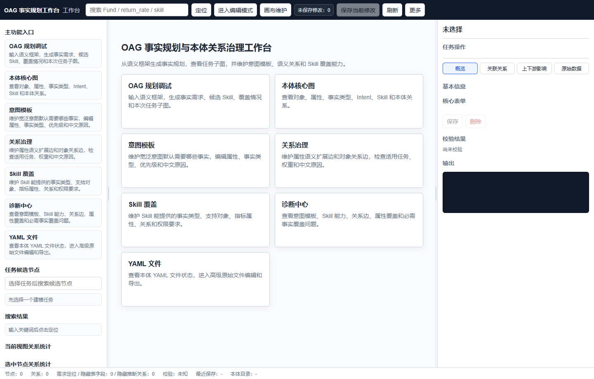
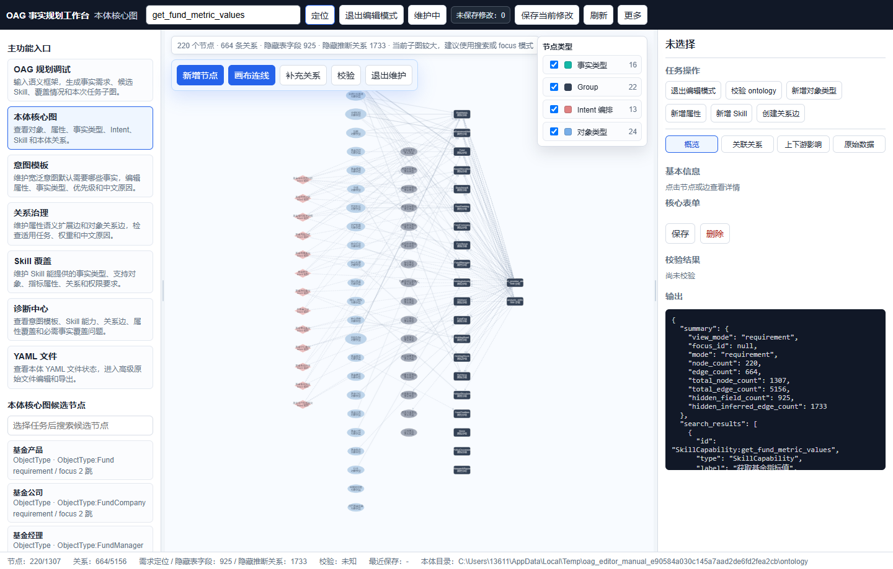
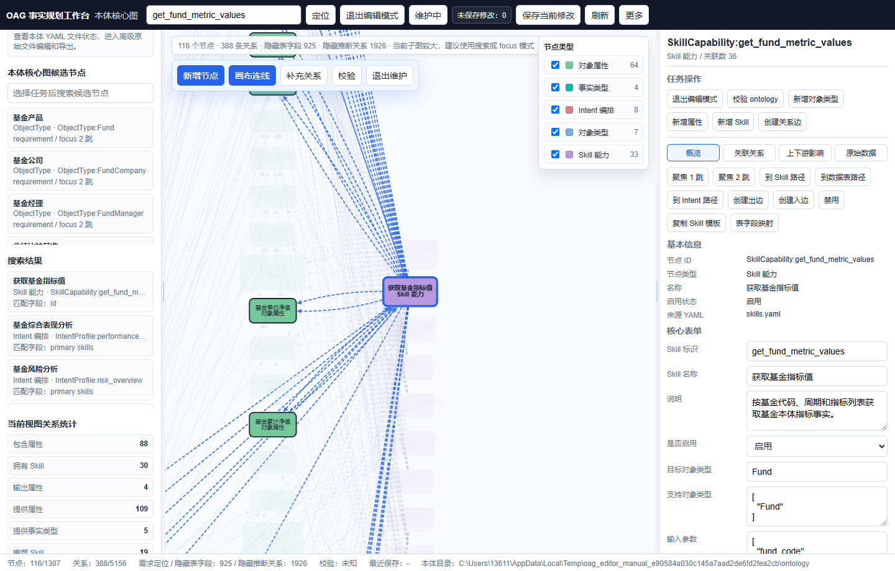
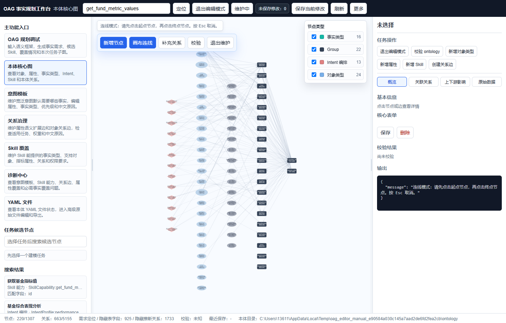
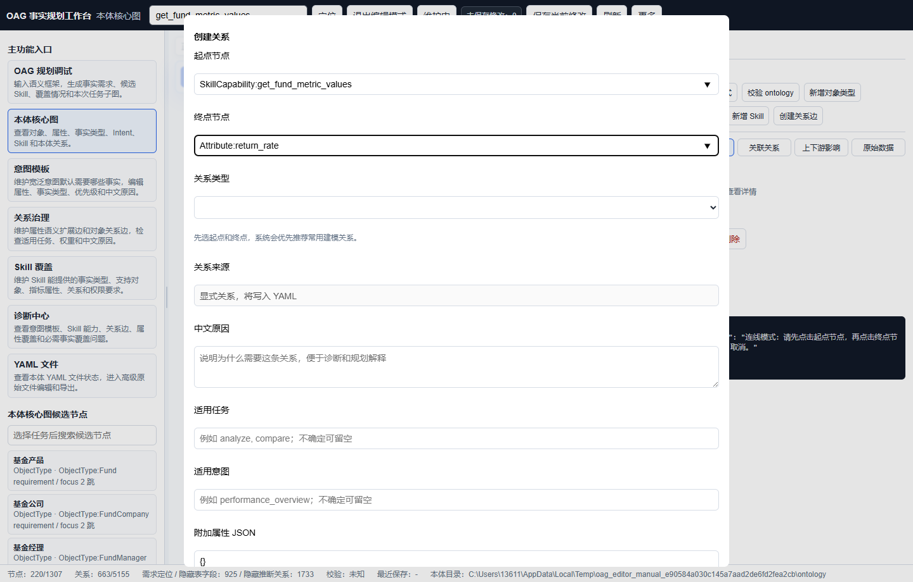
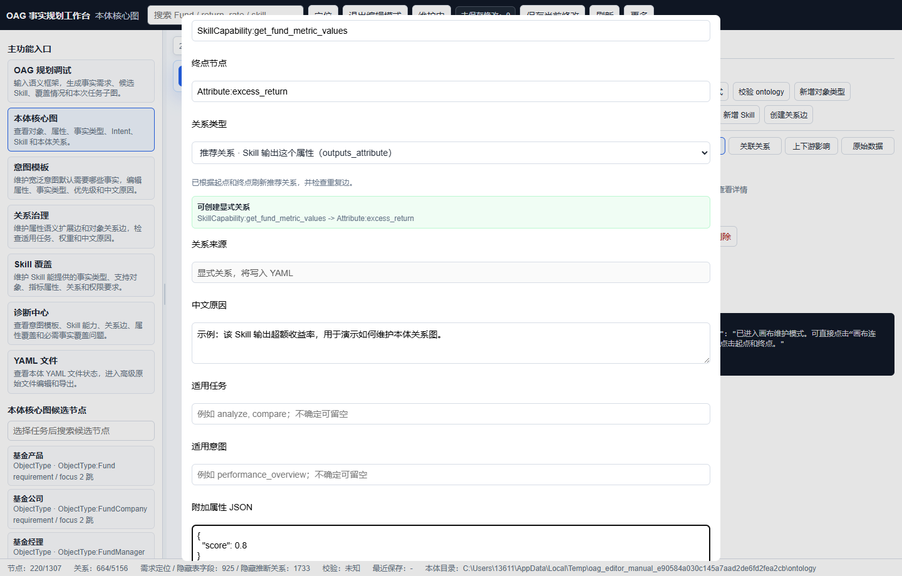
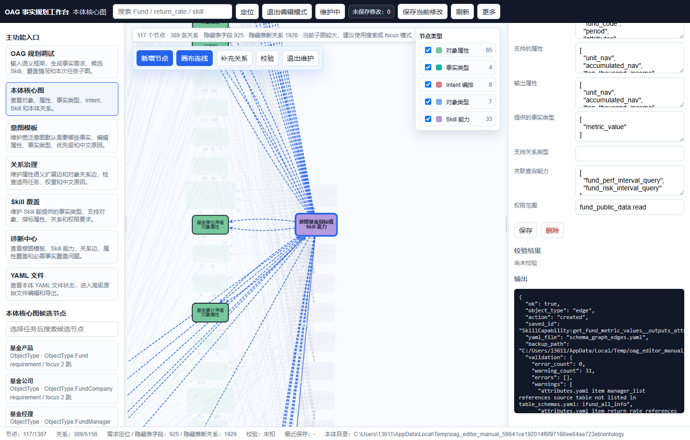
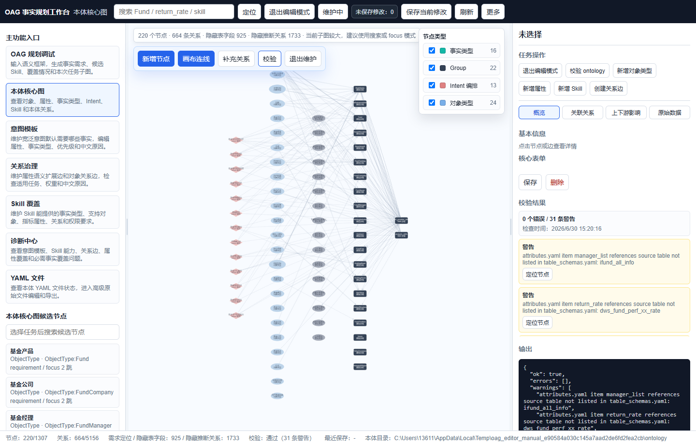
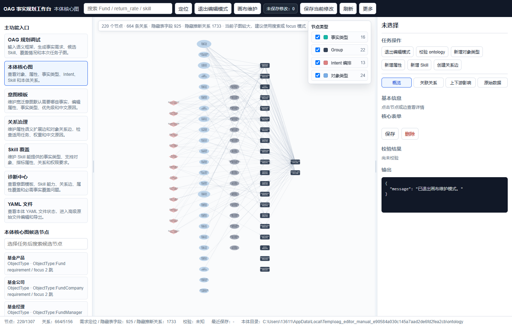

# OAG 工作台本体关系图维护说明书

> 这份说明书只讲一件事：如何在工作台里维护本体关系图。
>
> 截图来自当前工作台页面。为了截图时不改动主本体，示例保存动作是在临时本体副本里完成的。你真实使用时，保存会写回 `ontology/schema_graph_edges.yaml`，并自动生成备份。

## 1. 先理解你要维护的是什么

工作台中间的图就是本体关系图。

- 一个点叫“节点”，例如一个 Skill、一个属性、一个对象类型。
- 两个点之间的线叫“关系边”，例如“Skill 输出属性”“对象包含属性”。
- 虚线一般是系统根据 YAML 推断出来的关系。
- 实线一般是写在 YAML 里的显式关系。

日常维护最常见的工作就是：找到一个节点，给它补一条关系边，然后保存并校验。

下面用一个实际例子说明：

> 例子：给 `SkillCapability:get_fund_metric_values` 补一条关系，说明它能输出 `Attribute:alpha`。

## 2. 打开工作台

浏览器打开：

```text
http://127.0.0.1:8011
```

打开后先看到工作台首页。左边是功能入口，中间是图谱区域，右边是详情区。



如果页面打不开，先确认服务已经启动：

```powershell
.\.venv\Scripts\python.exe -m uvicorn ontology_editor.app:app --host 127.0.0.1 --port 8011
```

## 3. 进入画布维护模式

点击顶部的 `画布维护`。

进入后，顶部按钮会变成 `维护中`，画布上方会出现一排固定按钮：

- `新增节点`
- `画布连线`
- `补充关系`
- `校验`
- `退出维护`


维护模式的意思是：你现在可以做会写回 YAML 的操作。保存前系统仍会自动备份。

## 4. 搜索要维护的节点

本体图很大，不建议直接在图里硬找。

在顶部搜索框输入：

```text
get_fund_metric_values
```

然后点击 `定位`。

左侧搜索结果里会出现 “获取基金指标值”，它对应的节点 ID 是：

```text
SkillCapability:get_fund_metric_values
```



## 5. 打开节点详情

点击左侧搜索结果中的 “获取基金指标值”。

工作台会把图聚焦到这个 Skill 节点，右侧会显示它的详情。

右侧能看到：

- 节点 ID
- 节点类型
- 来源 YAML，例如 `skills.yaml`
- 常用字段表单
- 维护按钮，例如 `创建出边`、`创建入边`、`表字段映射`



如果你只是查看，不需要进入维护模式。只有要新增、修改、删除时才需要维护模式。

## 6. 开始补关系

补关系有两种入口。

第一种：点击画布上方的 `补充关系`。

第二种：先选中一个节点，再点击右侧的 `创建出边` 或 `创建入边`。

如果你点击 `画布连线`，工作台会进入连线状态。此时先点起点，再点终点。



本例为了讲清楚字段，使用 `补充关系` 打开关系弹窗。

## 7. 填写起点和终点

在弹窗里填写：

起点节点：

```text
SkillCapability:get_fund_metric_values
```

终点节点：

```text
Attribute:return_rate
```

工作台会马上检查：

- 起点是否存在
- 终点是否存在
- 已经有没有同类关系
- 推荐哪些关系类型

下面这张图里，工作台提示 `outputs_attribute / explicit` 已经存在，说明这条关系已经维护过了，不建议重复新增。



遇到“已存在关系”时，通常有三种处理方式：

- 如果原关系正确，就取消，不要重复保存。
- 如果原关系缺少中文原因、权重等信息，就打开已有关系补字段。
- 如果你确实要表达另一层含义，就换一个更合适的关系类型。

## 8. 换一个没有重复的终点并保存

本例换成 `Attribute:alpha`。

填写：

起点节点：

```text
SkillCapability:get_fund_metric_values
```

终点节点：

```text
Attribute:alpha
```

关系类型选择：

```text
outputs_attribute
```

中文原因填写：

```text
示例：该 Skill 输出 Alpha，用于演示保存后的回执。
```

附加属性 JSON 填写：

```json
{
  "score": 0.8
}
```



这里的 `score` 可以理解为这条关系的可信度或权重。语义关系、规划关系通常建议填写，便于后续诊断和推理解释。

确认无误后点击 `确定`。

## 9. 查看保存结果

保存成功后，弹窗会关闭，工作台回到图谱。

右侧输出区会显示保存回执。重点看这几项：

- `ok: true`：保存成功。
- `object_type: edge`：这次保存的是关系边。
- `action: created`：新建成功。如果是改已有边，可能显示 `updated`。
- `yaml_file: schema_graph_edges.yaml`：写入的 YAML 文件。
- `backup_path`：自动备份文件路径。
- `validation.error_count`：保存后校验发现的错误数量。



如果保存失败，右侧输出区或弹窗上方会显示错误原因。常见原因有：

- 起点节点不存在。
- 终点节点不存在。
- 关系类型不存在。
- JSON 写错了，例如少了逗号或括号。

## 10. 点击校验

保存后建议马上点击画布上方的 `校验`。

校验通过不代表没有任何警告。比如下面截图中：

- `0 个错误`：没有阻断问题。
- `31 条警告`：还有一些可继续治理的问题，但不一定阻止保存。



处理原则很简单：

- 有“错误”时，先处理错误。
- 只有“警告”时，可以根据业务优先级慢慢治理。
- 校验项里有 `定位节点` 按钮时，可以点击它直接跳到相关节点。

## 11. 退出维护模式

维护完成后点击 `退出维护`。

如果当前还有未保存修改，工作台会提醒你保存、放弃或取消退出。



## 12. 新手最常用的三条路径

### 路径一：给 Skill 补输出属性

适合这种情况：

> 某个 Skill 实际能返回某个指标，但图上看不到它和属性之间的关系。

操作：

1. 搜索 Skill ID。
2. 打开 Skill 节点。
3. 点击 `创建出边` 或 `补充关系`。
4. 终点选属性，例如 `Attribute:alpha`。
5. 关系类型选 `outputs_attribute` 或 `supports_attribute`。
6. 填中文原因和 `score`。
7. 保存并校验。

### 路径二：给对象补属性

适合这种情况：

> 一个对象类型下面应该有某个属性，但图上没有连起来。

操作：

1. 搜索对象类型，例如 `ObjectType:Fund`。
2. 点击 `创建出边`。
3. 终点选属性，例如 `Attribute:return_rate`。
4. 关系类型选 `has_attribute`。
5. 保存并校验。

### 路径三：把推断关系转成显式关系

适合这种情况：

> 图上有一条虚线关系，但你希望它明确写入 YAML，便于治理、解释和长期维护。

操作：

1. 点击图上的虚线关系。
2. 右侧会显示这条边的详情。
3. 点击 `转为显式关系`。
4. 补中文原因、适用任务、权重等字段。
5. 保存并校验。

## 13. 维护时的几个注意点

- 不要在全图里硬找节点，优先用搜索。
- 看到“已存在关系”时，不要重复保存。
- 能写中文原因就尽量写，后续诊断和推理解释会更清楚。
- 保存后看 `backup_path`，需要回退时可以找备份。
- 每次维护完都点一次 `校验`。
- 如果只是临时试验，可以用 `OAG_EDITOR_ONTOLOGY_DIR` 指向一个本体副本，避免改主 `ontology/`。

## 14. 一个完整例子的最终结果

本说明书里的例子最终表达的是：

```text
SkillCapability:get_fund_metric_values
  -- outputs_attribute -->
Attribute:alpha
```

它表示：

> “获取基金指标值”这个 Skill 可以输出 “Alpha” 这个属性。

写入 YAML 后，大致会成为一条 `schema_graph_edges.yaml` 里的显式边。后续规划、诊断、关系图展示都会读到这条关系。
